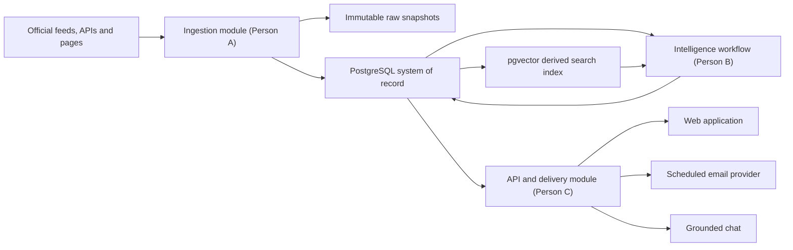
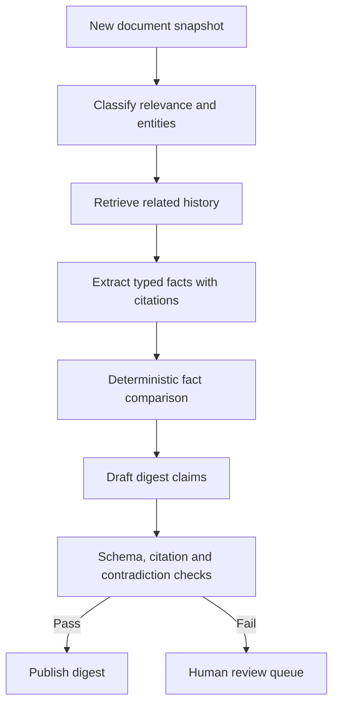

# Architecture Plan

## Status

Proposed baseline for team review before feature implementation.

## Architectural choice

Use a **modular monolith** with separately runnable API and background-job entry points.

This means one repository and one shared deployment codebase, but firm internal module boundaries. It is appropriate for three interns and a short delivery window: modules are easy to integrate and test without the deployment, networking, authentication, and observability burden of microservices.



## Proposed technology baseline

| Concern | Recommended choice | Reason |
|---|---|---|
| Language | Python 3.12 | Matches the agent/data ecosystem and mentor's quality-tool guidance. |
| Dependency management | uv + committed `uv.lock` | Fast, reproducible local and CI environments. |
| HTTP API | FastAPI + Pydantic v2 | Typed request/response validation and generated OpenAPI. |
| Relational store | PostgreSQL | Durable records, constraints, migrations, and subscription data. |
| Vector search | pgvector in the same PostgreSQL instance | Avoids a second database during the MVP while supporting semantic retrieval. |
| Database access | SQLAlchemy 2 + Alembic | Explicit persistence layer and reviewable migrations. |
| HTTP collection | httpx | Async support, timeouts, connection pooling, and testable transports. |
| Feed parsing | feedparser | Established RSS/Atom normalization. |
| Agent workflow | LangGraph | Explicit state and resumable, testable workflow steps. |
| Model adapters | LangChain interfaces where useful | Provider abstraction and structured-output integration. |
| Deep Agents | Only for a demonstrated long-horizon research task | Avoid adding an agent framework merely to satisfy a technology list. |
| Scheduling | One separately invoked job command plus cloud cron/scheduler | More reliable than an in-process web-server scheduler and simpler than Celery/Redis. |
| Email | Provider adapter selected at deployment | Keeps vendor credentials and behavior outside domain logic. |
| Front end | React + TypeScript + Vite, consuming the OpenAPI contract | Simple SPA build; TypeScript provides client-side checks. |
| Observability | Structured JSON logs, run IDs, request IDs, metrics | Makes source failures and digest generation auditable. |

The team should approve these choices in ADRs before adding runtime dependencies. If deployment constraints require different tools, change the ADR first.

## Module boundaries

```text
src/ai_daily_digest/
├── ingestion/       # collectors, normalization, snapshots, deduplication
├── intelligence/    # extraction, comparison, digest, evaluation, workflows
├── delivery/        # FastAPI routes, subscriptions, email, chat adapters
└── shared/          # stable models, ports/protocols, config, errors
```

### Ingestion — Person A

Inputs:

- Source definitions from `sources.yaml`.
- RSS/Atom, REST JSON, and permitted official HTML pages.

Outputs:

- Immutable raw response metadata/snapshot.
- Normalized `SourceItem`.
- `DocumentSnapshot` when content is new or changed.
- Per-source `CollectionRun` result, including failures.

It must not summarise, judge importance, or generate claims.

### Intelligence — Person B

Inputs:

- Normalized source items and historical snapshots.
- Retrieved records for the same product/model/topic.

Outputs:

- Structured `Fact` values with citations.
- `ChangeSet` containing previous and current evidence.
- `Digest` and `Claim` records whose citations are machine-checkable.
- Evaluation result: citation coverage, unsupported claims, and schema validity.

LangGraph is valuable here because nodes and state are explicit: retrieve history, extract facts, compare, draft, validate, and either publish or request review.

### Delivery — Person C

Inputs:

- Published digests, updates, changes, and subscriptions.

Outputs:

- Versioned HTTP API.
- Web user experience.
- Scheduled email delivery records.
- Grounded chat answers with citations.

It must not reach into collector internals or regenerate facts independently.

### Shared contracts

The `shared` package contains only structures genuinely required by more than one module. It must not become a miscellaneous dumping ground. Changes require one teammate review because they may block all three people.

## Data model

### Source

Configuration for a publisher endpoint: ID, publisher, URL, access method, cadence, status, and collection policy.

### CollectionRun

One source attempt: started/finished time, status, item count, HTTP metadata, parser version, error category, and retry count.

### SourceItem

The normalized identity and metadata of a published item: source, canonical URL, title, published time, summary, authors, and tags.

### DocumentSnapshot

An immutable version of fetched content: source item, fetch time, content hash, clean text, raw storage reference, ETag/Last-Modified, and collector version.

### Event

A grouping of independent source items that describe the same real-world announcement. This is distinct from deduplicating identical copies.

### Fact

A typed value extracted from a snapshot, such as price, model ID, context window, release status,
or deprecation date. It always carries a source snapshot and extraction method. LLM-extracted facts
also store `extraction_model` and `prompt_version`; deterministic facts leave those fields null.

### ChangeSet

A comparison between facts or snapshots. It stores the previous evidence, current evidence, change kind, confidence, and review status.

### Digest and Claim

A dated publication and its individual factual sentences. Each claim links to at least one source snapshot; unsupported claims prevent automatic publication.

### Subscription and EmailDelivery

Subscriber status and consent timestamps are separate from a delivery attempt. Store provider message ID, status, attempts, and error category; do not log full addresses.

## Storage rules

1. PostgreSQL is the source of truth for normalized records and relationships.
2. Raw responses are immutable. During local development they may use a controlled filesystem directory; production should use object storage or an immutable blob table.
3. Vector embeddings are derived from a specific snapshot and embedding-model version. They may be rebuilt.
4. Deleting or rebuilding the vector index must not delete source history.
5. All timestamps are timezone-aware UTC.
6. Database changes use Alembic migrations; never edit production tables manually.
7. `SourceItem.dedupe_key` has a unique constraint, while snapshots have a uniqueness constraint on
   `(source_item_id, content_hash)`. Insert code still handles conflicts safely so concurrent or
   retried collection runs are idempotent.
8. Email delivery has a unique idempotency key derived from subscription, digest, and delivery
   purpose. Retried jobs reuse the existing delivery record instead of sending again.

## Collection flow

1. Scheduler invokes `collect --due` with a unique run ID.
2. Registry selects due sources.
3. Collectors run independently with bounded concurrency, timeout, and retry policy.
4. Raw response metadata is recorded before parsing.
5. Adapter parses entries into normalized candidates.
6. URLs are canonicalized and exact duplicates checked.
7. Article content is cleaned and hashed.
8. A new snapshot is written only when the content hash changes.
9. Derived embedding work is queued or performed after the transaction commits.
10. A run summary records successes and failures. One source failure does not abort others.

## Intelligence workflow



Prefer deterministic code for URL normalization, hashing, dates, numeric comparison, citation validation, and deduplication. Use an LLM for language understanding and writing only where deterministic rules are insufficient.

Validation failure is fail-closed: retry a transient model/provider failure only within a bounded
policy; retry one schema failure with explicit structured-output feedback; then store the failure
and route it to review. Unsupported or contradictory claims are never automatically published.
For Milestone 1, the review queue is a persisted status and diagnostic reason owned by Person B;
the team must decide the human owner and response time before enabling automatic publication.

## Deployment shape

Initial production-like deployment needs three process types from the same codebase:

1. `api`: serves HTTP requests.
2. `worker`: runs collection and digest commands when invoked.
3. `web`: static frontend assets, either hosted separately or served behind the same platform.

Use the hosting platform's scheduler to invoke daily work. Do not run a scheduler inside every API process; multiple replicas could send duplicate emails.

## Reliability and observability

Every network call must have explicit timeouts. Retries apply only to transient failures and use backoff with jitter. Jobs must be idempotent so a retry cannot duplicate records or emails.

Log these identifiers where applicable:

- `request_id`
- `job_run_id`
- `source_id`
- `source_item_id`
- `digest_id`
- anonymized `subscription_id`

Minimum operational metrics:

- source success rate and freshness;
- items/snapshots created per run;
- zero-item anomalies;
- digest generation duration and failures;
- citation coverage;
- email success/bounce rate;
- API latency and error rate.

## Security model

- Collected pages and emails are untrusted content and may contain prompt injection. Store them as data and isolate them from system instructions.
- Use allowlisted source domains and validate redirects.
- Limit response size and accepted content types.
- Keep administrative job endpoints private; prefer scheduler commands over public unauthenticated endpoints.
- Hash unsubscribe tokens at rest and use one-click, expiring or revocable links.
- Minimize subscriber data and document retention/deletion behavior.

## Implementation sequence

### Milestone 0 — foundation

- Approve architecture, API/data contract, ownership, branch protection, and quality gates.
- Generate the lockfile and prove local/CI checks run.
- Commit a shared fixture pack under `tests/fixtures/contracts/`: at least 20 source items with
  snapshots, two change sets, and two digests. Include duplicates, a changed URL snapshot,
  malformed data, missing prior evidence, and an embedded prompt-injection string. Validate the
  pack in contract tests so all three modules use the same examples.

### Milestone 1 — vertical slice

- One RSS source produces a raw snapshot and normalized item.
- A deterministic placeholder comparison produces a change record.
- API returns it and web renders it using fake/real interchangeable contracts.
- An email is staged to a test sink, not real subscribers.

### Milestone 2 — module depth

- A adds the five collectors, normalization, deduplication, retries, and run reports.
- B adds historical retrieval, structured facts, LangGraph workflow, grounded digest, and evaluation.
- C adds web pages, subscriptions, chat, provider adapters, and deployment.

### Milestone 3 — production hardening

- Integration/E2E tests, migrations, observability, security checks, accessibility, backups, unsubscribe flow, failure drills, and one unattended daily run.

Before the first LLM-backed digest can publish automatically, the held-out fixture evaluation must
show valid schemas, citations that exist and support each factual claim, no unresolved
contradictions, and safe handling of prompt-injection text. Start with at least 20 held-out cases;
record model and prompt versions with every result and require human review for failures.

## Explicit non-goals for the first version

- Microservices.
- Kafka or another event-streaming platform.
- A separate vector database unless pgvector proves inadequate.
- Scraping search engines or social timelines.
- Autonomous publication of claims that fail citation validation.
- Adding every agent framework to every workflow.
