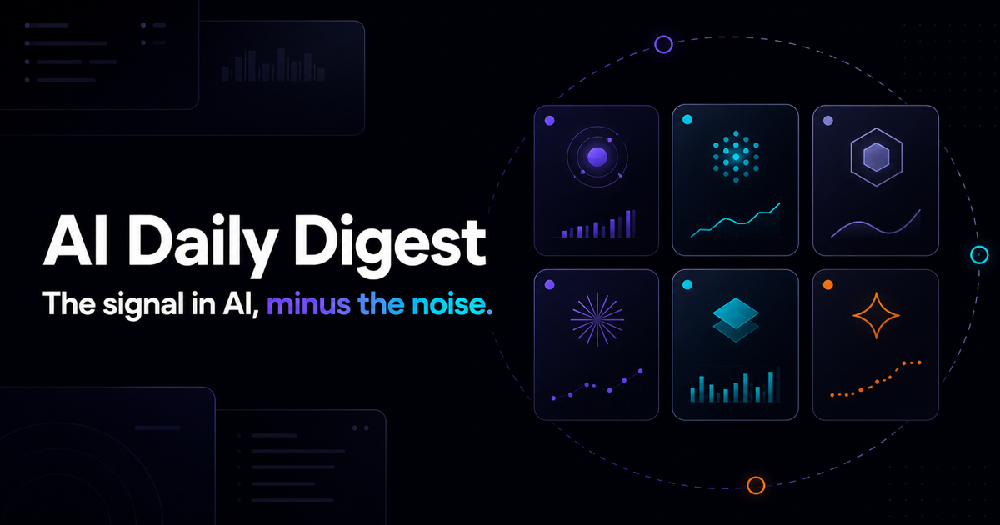

# Person C delivery UI design reference

> **Status: design reference only.** This document and its image do not define the production
> frontend, change an API contract, or represent live data. The existing visual prototype remains
> separate because it uses a Vinext/Next-style scaffold, while this repository's approved baseline
> is React, TypeScript, and Vite consuming the generated OpenAPI contract.

## Purpose

This reference preserves the current direction for the AI Daily Digest delivery experience so the
team can review the information hierarchy and interactions before production frontend work starts.
It combines an editorial news feed with a compact dashboard and keeps citations, evidence status,
and grounded chat visible to the reader.

The concept includes:

- a sticky header with digest-date navigation and an email subscription control;
- an animated model-family explorer with optional model details;
- a scroll-driven model story for Claude, GPT, Gemini, DeepSeek, Llama, and Grok;
- digest sections for Research, Industry, Policy, and Products;
- a desktop chat sidebar that becomes collapsible on smaller screens; and
- a trust strip summarising sourced and pending claims.

The current sample headlines, model prices, token estimates, and company details are illustrative.
They must not ship as hard-coded factual content.

## Contract mapping

| Interface element | Approved contract or source | Delivery note |
|---|---|---|
| Past-digest selector | `GET /v1/digests` | Use cursor pagination and the server-provided digest date/title. |
| Digest sections and article cards | `GET /v1/digests/{digest_id}` | Render published claims and preserve their citation snapshot IDs. Category grouping is not yet specified by the contract. |
| Source links and tracked-update details | `GET /v1/updates/{update_id}` and `GET /v1/changes/{change_id}` | Detail responses provide source attribution and previous/current evidence. The UI must not invent a source URL. |
| Subscribe control | `POST /v1/subscriptions` | Send email plus explicit consent and always display the privacy-preserving server response. Confirmation and unsubscribe use their dedicated endpoints. |
| Grounded chat | `POST /v1/chat/messages` | Render the answer, citations, and request ID. Show the server's insufficient-evidence response instead of filling gaps with client-side knowledge. |
| Model-family explorer | No public MVP endpoint currently defined | Begin with an explicitly labelled local fixture only after the frontend scaffold is approved, or propose a separate contract change. |
| Trust/accuracy strip | Claim `validation_status` and citation IDs partially support it | Aggregate counts and a `pending` definition need team agreement before this becomes a live metric. |

## Interaction and accessibility requirements

- The digest remains readable with animation disabled through `prefers-reduced-motion`.
- Carousel tiles, close controls, quick questions, source links, and send/subscribe actions are
  keyboard reachable and have visible focus states.
- Active state is communicated by more than colour; use text or an accessible state attribute.
- Sticky regions must not cover focused content, and the mobile reading order stays header, digest,
  chat, then trust information.
- Article and chat citations use descriptive link text rather than colour alone.
- Loading, empty, error, and insufficient-evidence states are part of the production implementation,
  even though they are not shown in this concept image.

## Production migration path

1. Wait for the team to approve the frontend/deployment ADRs and for the relevant delivery issue to
   define acceptance criteria.
2. Create the React + TypeScript + Vite application in the location agreed by that issue; do not copy
   framework-specific routing or build configuration from the separate prototype.
3. Generate or type the client from the repository's OpenAPI contract and build the digest list/detail
   vertical slice using contract fixtures.
4. Add subscriptions and grounded chat as separate, reviewable issues with error and privacy tests.
5. Add animation and model exploration progressively after the evidence-backed core flow works.

## Deliberately excluded from this reference

- runtime frontend code or dependencies;
- backend, database, shared-model, or OpenAPI changes;
- authentication, email-provider, and deployment implementation;
- production claims based on the illustrative sample data; and
- a new endpoint inferred solely from the visual design.

Those changes require their own issue, acceptance criteria, tests, and teammate review under the
repository workflow.
